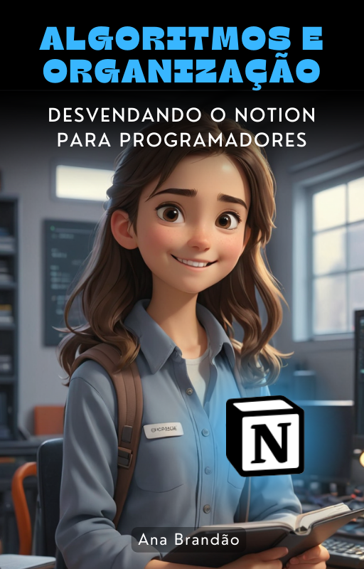

    

-------------

# Projeto EBOOK Gerado por I.A.s

 > ℹ️ **NOTE:** Este é o repositório desenvolvido durante o Bootcamp "IA para Devs" da [DIO](https://dio.me) e Santander

Projeto com o objetivo de gerar um ebook digital com as facilidades das ferramentas de IA. todos os prompts
seguem abaixo.

<a href="outputs/Algoritmos e Organização Desvendando o Notion para Programadores.pdf" title="View PDF now"> 📕Clique aqui para ler</a>

## 💻 Tecnologias utilizadas no projeto

- [ChatGPT](https://chat.openai.com/) 
- [MidJourney](https://www.midjourney.com/app/)

## 🧠 Prompts

ChatGPT：

|   Ação   | prompt                                                                                                                                                                                                                                                                         |
| :------: | ------------------------------------------------------------------------------------------------------------------------------------------------------------------------------------------------------------------------------------------------------------------------------ |
|  título  | Crie um titulo de um ebook sobre o tema de organização de estudos no Notion, o ebook é do nicho de programação, o titulo deve ser épico e curto e que tenha uma tematica mais nerd, me liste 5 variações de titulos.                                                        |
| conteúdo | Faça um texto para ebook , com foco em organização de estudos em programação no Notion, listando as principais técnicas e ferramentas a serem utilizadas {REGRAS} Explique sempre de uma maneira simples Deixe o texto enxuto, Sempre traga exemplos da utilização de tais ferramentas no Notion , sempre deixe um título sugestivo por tópico |

Midjourney：

|  Ação  | prompt                                                                                 |
| :----: | -------------------------------------------------------------------------------------- |
| título | a young girl in a programmer room, little smiling and holding a notebook, 3D animation style |

## ✨ Features

- Conteúdo gerado via ChatGPT
- Imagens geradas via MidJourney

## 📚 Materiais

- Imagens utilizadas em `assets`
- ebook gerado durante as aulas em `output`

## 🛠️ Instruções de execução

Utilize os prompts acima nas ferramentas sugeridas para gerar o material base e utilize uma ferramenta de edição de documentos como power point, libreoffice , indesign para diagramação.

